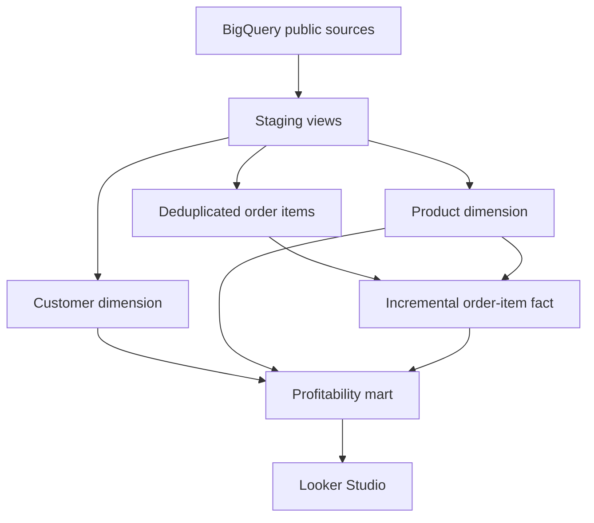
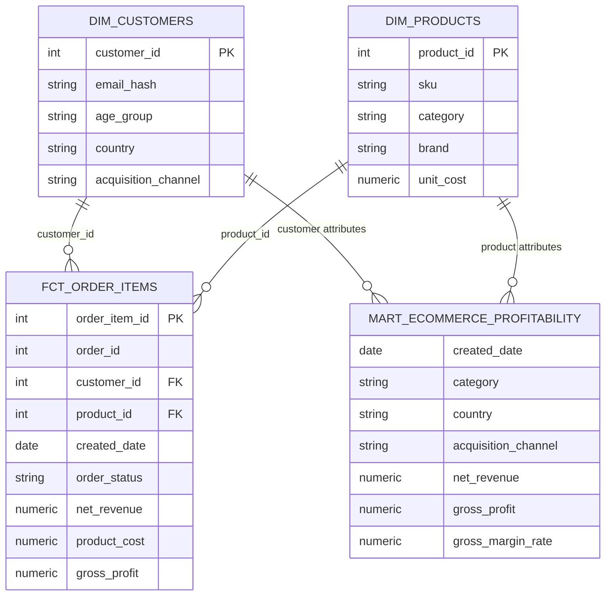

# Architecture and Data Model

## Decision summary

This project uses a layered dimensional model because the primary consumers are BI users who need understandable dimensions, predictable joins, and fast aggregation of profitability metrics.

| Layer | Purpose | Materialization |
| --- | --- | --- |
| Source | Public ecommerce operational data | BigQuery public tables |
| Staging | Rename, type, normalize, and minimize PII | Views |
| Intermediate | Apply reusable business-neutral logic such as deterministic deduplication | Ephemeral |
| Dimensions | Provide descriptive customer and product attributes | Tables |
| Fact | Store additive financial measures at order-item grain | Incremental table |
| Reporting | Aggregate governed metrics for direct BI consumption | Table |

## End-to-end flow



## Dimensional model



## Grain and join safety

The canonical fact grain is **one row per order item**, identified by `order_item_id`. Every financial measure is calculated at this grain before aggregation. This prevents fanout when joining product and customer attributes.

The reporting mart is aggregated by date and selected product/customer attributes. Financial amounts are additive. Ratios must be recalculated from additive components:

```text
Gross margin rate = SUM(gross_profit) / SUM(net_revenue)
```

Summing precomputed percentages is intentionally avoided. Distinct order and customer counts are non-additive across dimensions and should not be summed across category or brand groups.

## Incremental strategy

`fct_order_items` uses BigQuery `merge` with `order_item_id` as its unique key.

- A three-day lookback captures late updates such as returns.
- Partitioning by `created_date` reduces date-filtered scan volume.
- Clustering by status, product, and customer supports common filters and joins.
- `on_schema_change='sync_all_columns'` handles additive schema evolution.
- A full refresh remains available for backfills or logic corrections.

The BigQuery Sandbox permits the initial table build but restricts subsequent DML `MERGE` execution without billing. In production, successful incremental execution would be a required deployment check.

## Governance controls

- Raw email is removed after staging; only a normalized SHA-256 hash is exposed downstream.
- Primary keys are tested for uniqueness and nulls.
- Foreign keys are tested with dbt relationships tests.
- Status values are constrained with an accepted-values test.
- A singular test validates the accounting identities:
  - gross revenue - refunds = net revenue
  - net revenue - product cost = gross profit

Hashing is pseudonymization, not anonymization or access control. A production design would combine it with least-privilege IAM, policy tags, column-level security, and audit logging.

## Trade-offs and production extensions

| Current choice | Benefit | Limitation | Production extension |
| --- | --- | --- | --- |
| Current product cost | Simple and available | Rewrites historical economics if cost changes | Type-2 product-cost dimension |
| Full reversal for returns | Clear accounting rule | Ignores partial refunds and fees | Payment and refund event facts |
| Three-day lookback | Low scan cost | Misses very late changes | Updated-at watermark and periodic backfill |
| Reporting table | Simple BI connection | Repeated aggregates and refresh latency | Semantic layer or incremental aggregate |
| SHA-256 email hash | Removes direct PII | Vulnerable to dictionary matching | Salted/tokenized identity service |

## Alternatives considered

- **3NF:** better for operational consistency, but less convenient for BI queries and metric explanation.
- **Data Vault:** stronger historization and auditability, but excessive complexity for a small demonstration dataset.
- **One denormalized table:** fastest to build, but weak ownership boundaries, repeated logic, and reduced testability.

Dimensional modeling provides the best balance of interview breadth, business usability, and explainable technical depth.
